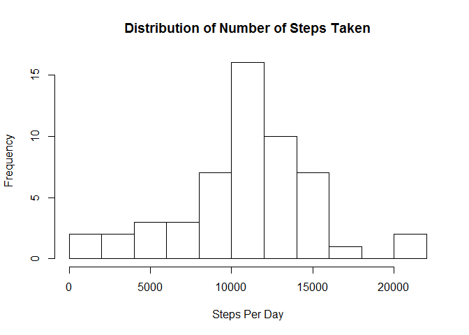
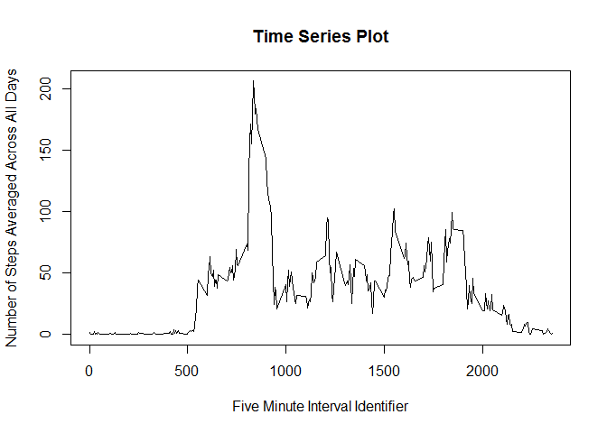
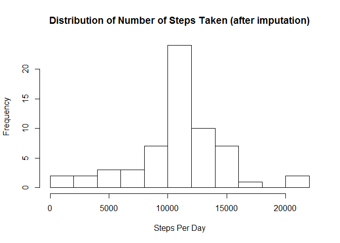
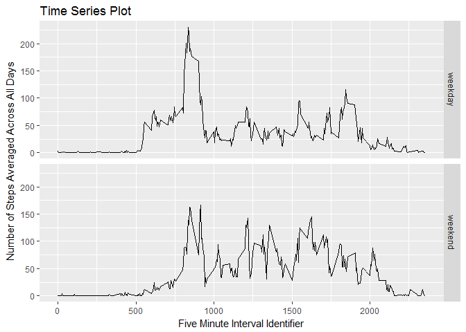

# Reproducible Research: Peer Assessment 1
Abhimanyu Banerjee  
January 11, 2017  


## Loading and preprocessing the data

First we will set up the environment by pre-emptively cleaning the workspace, loading in packages needed for the analysis, setting up a data directory and unzipping the dataset zip file. After the contents of the zip file have been unzipped we load the dataset into a dataframe.  


```r
#clean the workspace before beginning
rm(list = ls())

#using lubridate_1.6.0 and dplyr_0.5.0
require("lubridate")
require("dplyr")

#create a data directory if it doesn't already exist
if(!file.exists("data")){
    dir.create("data")
}

#unzip the dataset and load it into a dataframe
zipContents <- unzip("activity.zip", exdir = "./data")
activityData <- read.csv(zipContents)

#convert the date variable from char to Date object
activityData$date <- as_date(activityData$date)
```

## What is mean total number of steps taken per day?

To figure out the mean total number of steps taken per day, we group the records in the dataset by the *date* and then compute the sum of the observations of the *steps* variable in each group. This summary is then plotted as a histogram to gauge the overal distribution of the steps taken per day while the mean and median of the same summary is computed to get a more detailed picture of the distribution.  


```r
#summarize the number of steps for each day
stepSummaryByDate <- activityData %>%
                group_by(date) %>%
                summarize(dailySteps = sum(steps))
with(stepSummaryByDate, hist(dailySteps, xlab = "Steps Per Day", breaks=10,
                main = "Distribution of Number of Steps Taken"))
```

<!-- -->

```r
#calculate the mean and median number of steps taken per day
meanSteps <- as.integer(mean(stepSummaryByDate$dailySteps, na.rm=T))
medianSteps <- median(stepSummaryByDate$dailySteps, na.rm=T)
```

The mean number of steps taken per day is approximately *10766* and the median number of steps taken per day is *10765*

## What is the average daily activity pattern?

In order to understand the average daily activity pattern, we first group the records in the dataset by the *5-min interval* identifier, i.e. by the interval in which the observation was made. Then the mean of the observations of the *steps* variable in each group (averaged across all the days) is computed. This summary data is then plotted as a time series plot to visualize any patterns in the daily activity pattern.  


```r
#summarize the number of steps for each 5min interval averaged over all the days
stepSummaryByInterval <- activityData %>%
                        group_by(interval) %>%
                        summarize(avgSteps = mean(steps, na.rm=T))
with(stepSummaryByInterval, plot(interval, avgSteps, type="l", 
                                 xlab="Five Minute Interval Identifier",
                                 ylab="Number of Steps Averaged Across All Days",
                                 main = "Time Series Plot"))
```

<!-- -->

```r
#get the 5-min interval with the maximum average number of steps
maxRow <- which.max(stepSummaryByInterval$avgSteps)
maxStepInterval <- stepSummaryByInterval[[maxRow, "interval"]]
```

The 5-min interval identifier with the maximum number of steps taken on average (across all days) is ***835***

## Imputing missing values

In the following script, we find the total number of missing records, impute them using the mean of the missing record with respect to the interval it was observed in and finally create a new dataset with the missing values imputed.  


```r
#compute the number of rows with missing data
numMissingData <- sum(is.na(activityData))

#replace the missing data with the mean for each 5-min interval
meanStepsPerInterval <- with(activityData, 
                             tapply(steps, as.factor(interval), mean, na.rm=T))
missingRowsMask <- is.na(activityData$steps)
missingData.intervals <- as.character(activityData$interval[missingRowsMask])

imputedActivityData <- activityData
imputedActivityData$steps[missingRowsMask] <- meanStepsPerInterval[missingData.intervals]
```

The **activity dataset** contains *2304* rows with ***missing data***.

The following code creates a histogram of the number of steps taken per day on average after the missing values in the original dataset have been imputed.  


```r
stepSummaryByDate <- imputedActivityData %>%
                group_by(date) %>%
                summarize(dailySteps = sum(steps))

with(stepSummaryByDate, hist(dailySteps, xlab = "Steps Per Day", breaks=10,
main = "Distribution of Number of Steps Taken (after imputation)"))
```

<!-- -->

```r
#calculate the mean and median number of steps taken per day after imputation
meanStepsImp <- as.integer(round(mean(stepSummaryByDate$dailySteps, na.rm=T)), 3)
medianStepsImp <- as.integer(round(median(stepSummaryByDate$dailySteps, na.rm=T)), 3)
```

After imputing the missing records, the mean number of steps taken per day is approximately *10766* and the median number of steps taken per day is approximately *10766*. Since, the chosen method of imputation was taking the mean of the missing record with respect to interval it was observed in, the imputation caused the mean and the median to become aligned. So, the mean did not change from before while the median increased to become equal to the mean.  

## Are there differences in activity patterns between weekdays and weekends?

To find any differences in the activity patterns between weekdays and weekends, we first create a new factor variable *dayType* in the new dataset with the missing values imputed. This variable will categorize the date for each record in the dataset as either **'weekday'** or **'weekend'**. Next, we group the records in the dataset by the *interval* and the *dayType* (the latter used to break ties, if any) and then compute the mean of the observations of the *steps* variable in each group (averaged across all the days). Finally, we plot this summary data as a time series plot (one for each *dayType*) to visualize any differences in activity patterns between weeekdays and weekends.  


```r
newActivityData <- imputedActivityData %>%
    mutate(dayType = ifelse(wday(date) == 1 | wday(date) == 7, "weekend", "weekday")) %>%
    mutate(dayType = as.factor(dayType))

#using ggplot2_2.2.0
library(ggplot2)

#summarize the number of steps for each 5min interval averaged over all the days
stepSummaryByInterval <- newActivityData %>%
                        group_by(interval, dayType) %>%
                        summarize(avgSteps = mean(steps, na.rm=T))
plot <- qplot(interval, avgSteps, data=stepSummaryByInterval, geom="line",
              main="Time Series Plot", xlab="Five Minute Interval Identifier",
              ylab="Number of Steps Averaged Across All Days")
plot <- plot + facet_grid(dayType~.) + guides(fill=F)
print(plot)
```

<!-- -->
